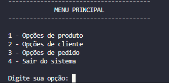
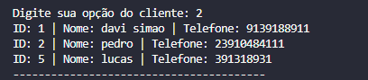
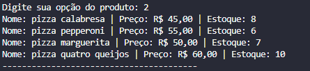
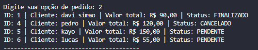
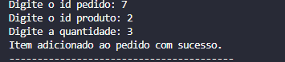
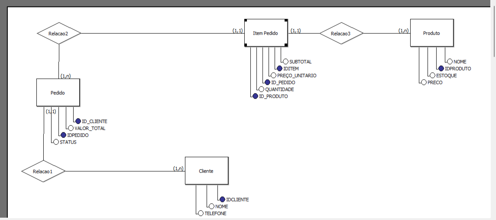

# 🍕 Sistema de Gerenciamento de Pizzaria


Sistema backend desenvolvido em Python para gerenciamento de clientes, produtos, pedidos e controle de estoque utilizando SQLAlchemy ORM e MySQL.

O projeto foi construído com foco em:

* arquitetura backend
* modelagem relacional
* regras de negócio
* organização em camadas
* boas práticas com ORM

---

# 🚀 Tecnologias utilizadas

* Python
* MySQL
* SQLAlchemy ORM
* PyMySQL

---

# ✨ Funcionalidades

## 👤 Clientes

* Cadastro de clientes
* Atualização de dados
* Remoção de clientes
* Listagem de clientes
* Validação de telefone único

---

## 🍕 Produtos

* Cadastro de produtos
* Atualização de produtos
* Remoção de produtos
* Controle de estoque
* Listagem de produtos

---

## 📦 Pedidos

* Criação de pedidos
* Adição de produtos ao pedido
* Cálculo automático de subtotal
* Atualização automática do valor total
* Finalização de pedidos
* Cancelamento de pedidos
* Reposição automática do estoque ao cancelar pedidos

---

# 🧠 Regras de negócio implementadas

O sistema possui validações e regras de negócio para garantir consistência dos dados:

* Não permite pedidos para clientes inexistentes
* Não permite adicionar itens em pedidos finalizados ou cancelados
* Não permite finalizar pedidos sem itens
* Validação de estoque disponível
* Atualização automática do estoque
* Controle automático do valor total do pedido
* Produtos duplicados não são permitidos
* Telefones duplicados não são permitidos

---

# 🏗️ Arquitetura do projeto

O projeto foi organizado em camadas para separar responsabilidades:

```bash
sistema_pizzaria/
│
├── assets/
│   ├── menu.png
│   ├── clientes.png
│   ├── produtos.png
│   ├── pedidos.png
│   ├── controle-estoque.png
│   └── modelagem-relacional.png
│
├── database/
│   └── connection.py
│
├── interface/
│   ├── menu.py
│   ├── menu_cliente.py
│   ├── menu_produto.py
│   ├── menu_pedido.py
│   └── formatters.py
│
├── models/
│   ├── cliente.py
│   ├── produto.py
│   ├── pedido.py
│   └── item_pedido.py
│
├── services/
│   ├── cliente_service.py
│   ├── produto_service.py
│   └── pedido_service.py
│
├── requirements.txt
├── README.md
└── main.py
```


# 🗃️ Modelagem relacional

O sistema utiliza SQLAlchemy ORM com relacionamentos entre entidades.

## Relacionamentos implementados

```text id="bq8owu"
Cliente 1:N Pedido
Pedido 1:N ItemPedido
Produto 1:N ItemPedido
```

A entidade `ItemPedido` funciona como tabela associativa entre pedidos e produtos, armazenando:

* quantidade
* subtotal
* preço unitário

---

# 📸 Demonstração do sistema

## 🖥️ Menu principal



---

## 👤 Gerenciamento de clientes



---

## 🍕 Gerenciamento de produtos



---

## 📦 Fluxo de pedidos



---

## 📉 Controle automático de estoque



---

## 🗃️ Modelagem relacional do banco



---

# ⚙️ Como executar o projeto

## 1. Clone o repositório

```bash id="9szt0u"
git clone https://github.com/davibsimao/sistema-pizzaria-python-sql
```

---

## 2. Acesse a pasta do projeto

```bash id="e0j8ql"
cd sistema-pizzaria-python-sql
```

---

## 3. Crie o ambiente virtual

```bash id="hhc3df"
python -m venv .venv
```

---

## 4. Ative o ambiente virtual

### Windows

```bash id="6vw0f3"
.venv\Scripts\activate
```

---

## 5. Instale as dependências

```bash id="xw3d4m"
pip install sqlalchemy pymysql
```

---

## 6. Crie o banco de dados MySQL

```sql id="m8n7qz"
CREATE DATABASE sistema_pizzaria;
```

---

## 7. Configure a conexão com o banco

Edite o arquivo:

```text id="9s6ydb"
database/connection.py
```

e configure suas credenciais MySQL.

---

## 8. Execute o sistema

```bash id="o4rk2m"
python main.py
```

---

# 📌 Conceitos aplicados no projeto

* SQLAlchemy ORM
* Relacionamentos entre tabelas
* Foreign Keys
* Arquitetura em camadas
* Regras de negócio
* Sessions do SQLAlchemy
* Organização modular
* Tratamento de erros
* Controle de estoque
* CRUD completo
* Relacionamentos ORM com `relationship()`
* Otimização de consultas com `joinedload()`

---

# 🎯 Objetivo do projeto

Este projeto foi desenvolvido com o objetivo de aprofundar conhecimentos em backend Python, modelagem relacional e construção de sistemas utilizando SQLAlchemy ORM.

---

# 👨‍💻 Autor

Desenvolvido por Davi Simão.
